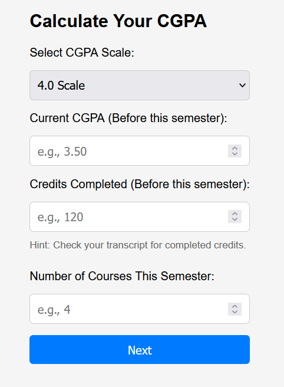
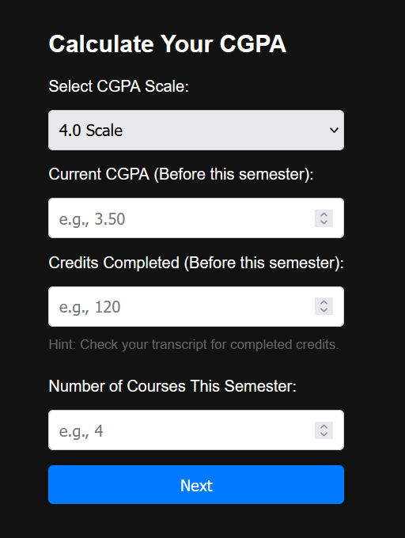

---

# CGPA Calculator

[](LICENSE)  
[](https://github.com/mohiuddin-khan-shiam/CGPA-Calculator)

The **CGPA Calculator** is a user-friendly web tool that allows students to calculate their updated Cumulative Grade Point Average (CGPA) by entering their current CGPA, completed credits, and details for the current semester's courses. It supports standard scales (4.0, 5.0, 10.0) as well as a custom scale option.

## Table of Contents

- [Features](#features)
- [Demo](#demo)
- [Installation](#installation)
- [Usage](#usage)
- [Repository Structure](#repository-structure)
- [License](#license)
- [Contributing](#contributing)
- [Screenshots](#screenshots)
- [Contact](#contact)

## Features

- **Dynamic Input Forms:**  
  Easily input your current CGPA, completed credits, and details for multiple courses (GPA and credit per course).
- **Customizable CGPA Scale:**  
  Choose from preset scales (4.0, 5.0, 10.0) or enter your own custom scale.
- **Dark/Light Mode Toggle:**  
  Seamlessly switch between dark and light themes.
- **Responsive Design:**  
  Optimized for both desktop and mobile devices.
- **Accessibility Enhancements:**  
  Includes ARIA attributes, keyboard navigation support, and a skip-to-content link.
- **Real-time Feedback:**  
  Immediate error messages and subtle animations to confirm successful calculations.

## Demo

You can view the live demo of the CGPA Calculator on GitHub Pages:  
[https://mohiuddin-khan-shiam.github.io/CGPA-Calculator/](https://mohiuddin-khan-shiam.github.io/CGPA-Calculator/)

## Installation

1. **Clone the repository:**

   ```bash
   git clone https://github.com/mohiuddin-khan-shiam/CGPA-Calculator.git
   cd CGPA-Calculator
   ```

2. **Open the project:**

   You can simply open `index.html` in your web browser. No additional build steps or dependencies are required.

## Usage

1. **Enter your details:**  
   Fill in your current CGPA, the total number of credits completed, and the number of courses for the current semester.

2. **Select your CGPA scale:**  
   Choose a preset scale or select "Other" to enter a custom scale.

3. **Input course details:**  
   Enter GPA and credit information for each course. Optionally, you can add a course name.

4. **Calculate:**  
   Click "Next" to generate course fields, then "Calculate CGPA" to view your updated CGPA.

5. **Reset:**  
   Use the "Start Over" button if you want to perform another calculation.

## Repository Structure

```
CGPA-Calculator/
├── index.html         # Main HTML file for the application
├── style.css          # CSS file for styling the website
├── script.js          # JavaScript file for dynamic behavior and form validation
├── favicon.ico        # Favicon for the website
├── dark-mode.png      # Screenshot/icon representing dark mode
├── light-mode.png     # Screenshot/icon representing light mode
├── LICENSE            # MIT License
└── README.md          # This README file
```

## License

This project is licensed under the **MIT License**. See the [LICENSE](LICENSE) file for details.

## Contributing

Contributions are welcome! If you find any issues or have suggestions for improvement, please open an issue or submit a pull request. For major changes, please open an issue first to discuss what you would like to change.

## Screenshots

### Light Mode



### Dark Mode



## Contact

Created by **S. M. Mohiuddin Khan Shiam**.  
For any questions or feedback, feel free to reach out via [LinkedIn](https://www.linkedin.com/in/s-m-mohiuddin-khan-shiam/) or [GitHub](https://github.com/mohiuddin-khan-shiam).

---

Feel free to adjust this README as needed to better match your project's specifics or additional details you’d like to share.
